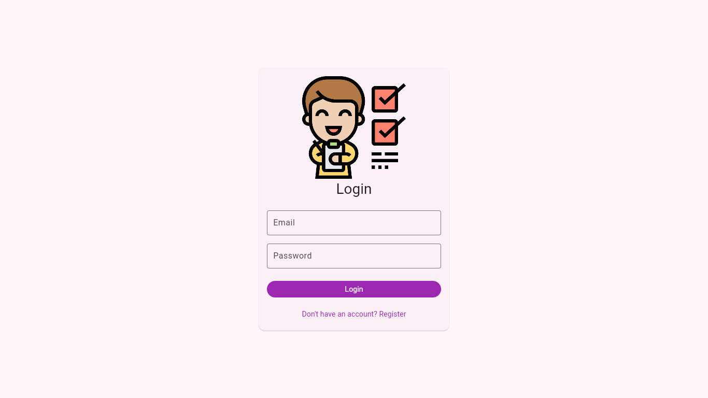
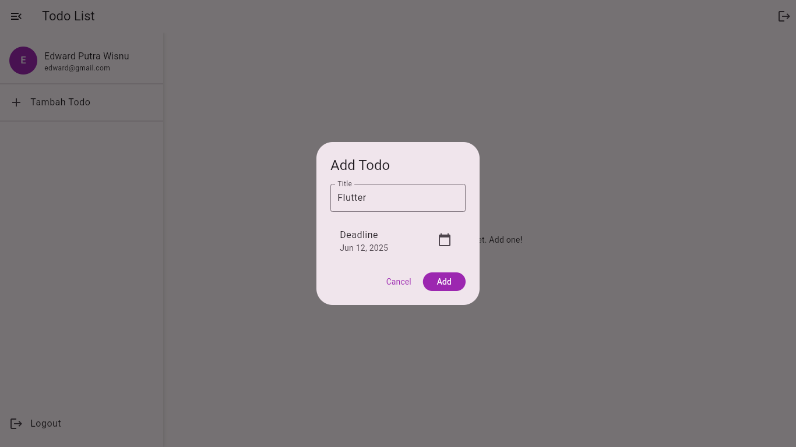
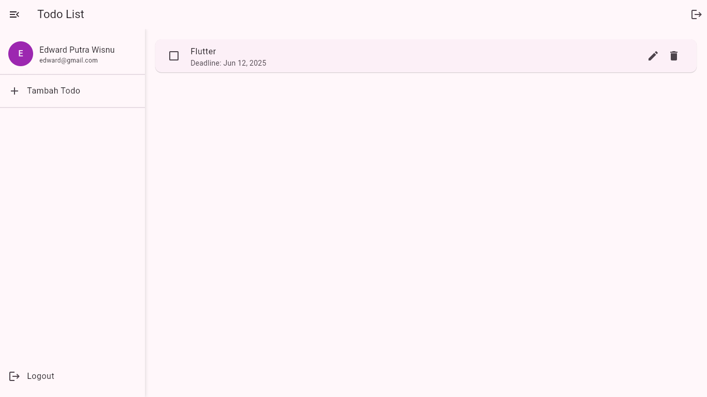
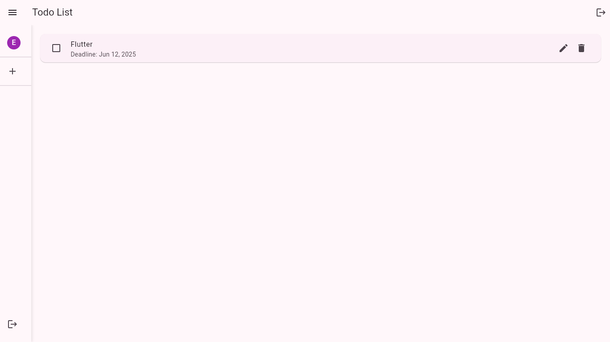

# Todo List App

## Profil
**Nama**: Edward Putra Wisnu  
**Kelas**: RJ23C  
**NIM**: 2390343034

## Judul Project
Todo List App - Aplikasi Manajemen Tugas Sederhana

## Deskripsi Fungsionalitas Aplikasi
Todo List App adalah aplikasi manajemen tugas sederhana yang memungkinkan pengguna untuk:
- Membuat tugas baru dengan judul dan deskripsi
- Melihat daftar tugas yang ada
- Menandai tugas sebagai selesai
- Menghapus tugas yang tidak diperlukan
- Mengelola tugas dengan antarmuka yang intuitif dan mudah digunakan

## Teknologi yang Digunakan
- **Frontend Framework**: Flutter
- **State Management**: Provider
- **Backend & Database**: Firebase
  - Firebase Authentication untuk manajemen pengguna
  - Cloud Firestore untuk penyimpanan data
- **Bahasa Pemrograman**: Dart
- **Development Tools**: 
  - Android Studio / VS Code
  - Flutter SDK
  - Git untuk version control

## Cara Menjalankan Aplikasi

### Prasyarat
1. Flutter SDK terinstal di komputer Anda
2. Android Studio atau VS Code dengan Flutter extension
3. Emulator Android/iOS atau perangkat fisik untuk testing

### Langkah-langkah Instalasi
1. Clone repository ini:
```bash
git clone https://github.com/ransomm911/todolist_app.git
```

2. Masuk ke direktori proyek:
```bash
cd todolist_app
```

3. Install dependencies:
```bash
flutter pub get
```

4. Jalankan aplikasi:
```bash
flutter run
```

## Screenshot UI dan Tampilan

### Halaman Login


### Halaman Tambah Todo


### Halaman Todo List


### Halaman Hasil Todo


### Halaman Ganti Password


### Halaman Ganti Username


## Kontribusi
Silakan buat pull request untuk kontribusi. Untuk perubahan besar, harap buka issue terlebih dahulu untuk mendiskusikan perubahan yang diinginkan.

## Lisensi
[MIT](https://choosealicense.com/licenses/mit/)